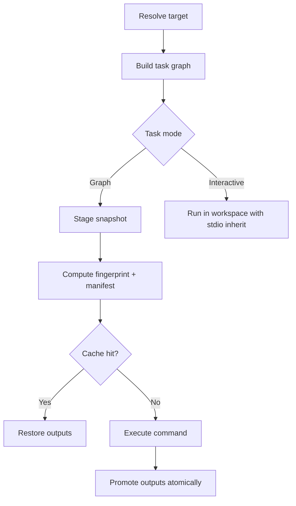

# Engine Overview

Broski has two task modes:

- **Graph mode**: staged, cached, deterministic, output-validated.
- **Interactive mode**: direct workspace execution with inherited TTY.

## Determinism Contract

Graph tasks must declare inputs and outputs. The runner fingerprints relevant execution state, including:

- command
- resolved variables and parameters
- explicit environment keys
- input file content hashes
- mode/isolation metadata

## What is validated before execution

- dependency graph must be resolvable (cycles rejected via topological sort)
- task names cannot collide with reserved CLI command names
- required tools (`@requires`) are checked once per unique tool name across the **entire resolved graph**,
  before any task in the run starts
- graph-mode tasks rely on declared contracts (`@in`, `@out`) for deterministic reuse

## Sandbox internals (`@isolation strict`)

Strict isolation is implemented via [`bwrap`](https://github.com/containers/bubblewrap) and is Linux-only. The
sandbox: unshares the network namespace, read-only binds `/usr`, `/bin`, `/lib` (and `/lib64` if present), gives
an empty writable `/etc` plus a read-only-bound `/etc/resolv.conf`, tmpfs-masks `$HOME`, mounts `/proc`, `/dev`,
and a fresh `/tmp`, and binds only the task's own stage directory read-write. `--force-isolation` requires
`bwrap` on `PATH` and fails the run up front if it's missing; it's also rejected for interactive tasks, since
those run directly in the workspace by design. `best_effort` and `off` never invoke `bwrap` — they differ only
in environment handling: `best_effort` (like `strict`) clears the environment to a minimal safe set before
applying `@env`/`@secret_env`; `off` inherits the full parent environment unchanged.

## Streaming execution: `ProgressEvent`, cancellation, and history

Introduced in `v0.7.0`, three engine-level APIs sit underneath the CLI, TUI, and any future integration:

- **`ProgressEvent`** — a structured stream (`RunStarted`, `TaskQueued`, `TaskStarted`, `TaskPhase`, `LogLine`,
  `TaskFinished`, `RunFinished`) exposed via `RunOptions::event_sink: Option<Sender<ProgressEvent>>`. Opt-in only
  — the classic spinner-based CLI output is byte-identical when no sink is provided. `capture_output: bool`
  additionally enables line-by-line stdout/stderr streaming as `LogLine` events. This is what the TUI dashboard
  is built on, and it's a stable integration point for CI dashboards or IDE plugins that want structured
  execution data instead of parsing terminal output.
- **`CancellationToken`** — cooperative, two-level cancellation. `CancelLevel::Soft` flips an atomic flag; the
  executor stops starting new tasks but lets in-flight ones finish. `CancelLevel::Hard` additionally sends
  `SIGTERM` to every registered child PID (Unix only). A task whose process exits non-zero *because* it was
  hard-cancelled is treated as a graceful stop, not a failure. This backs the TUI's two-stage Ctrl-C.
- **Versioned execution records** — `ExecutionRecord` gained `duration_ms`, and `ArtifactStore` gained
  `fetch_history(task, limit)` and `stats()` (object count + total bytes). These back `broski history` and the
  TUI's cache/session stats cards.

## Interactive-task concurrency

Non-interactive (graph-mode) runs take a workspace-level lock (`.broski/runtime/active.lock`) for the duration
of the run, so two overlapping `broski run` invocations against the same workspace don't race. **Runs whose
entire resolved graph is interactive-only skip this lock entirely** — this is deliberate, so you can run two
different interactive tasks (e.g. a dev server in one terminal, a REPL in another) against the same workspace
at once without one blocking the other.

## Operational trade-offs

- interactive mode gives terminal-first UX, but bypasses graph caching entirely — no cache read, no cache write
- graph mode gives deterministic reuse, but requires explicit contracts
- strict isolation may require host capabilities not available in every local environment (Linux + `bwrap`)

Use:

- [Cache Explainability](./cache-explain) for rerun diagnostics
- [TUI Dashboard](../cli/tui) for the live event-stream-backed dashboard
- [Troubleshooting](../operations/troubleshooting) for common failure modes
